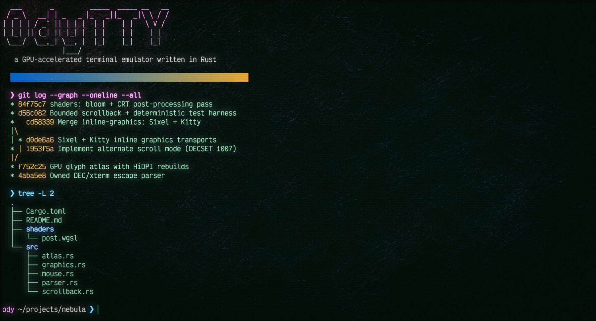

# OdyTTY

<a id="contents"></a>

[Website](https://odytty.unfinished-works.com) |
[Latest release](https://github.com/ghreprimand/odytty/releases/latest) |
[Install guide](docs/install.md) |
[Documentation](#project-docs) |
[Issues](https://github.com/ghreprimand/odytty/issues)



**A from-scratch, GPU-rendered Rust terminal with an Odyssey visual identity.**

OdyTTY owns the terminal path from the PTY through escape parsing, terminal
state, text layout, and shaders. It pairs that foundation with fast readable
text, tabs and panes, inline media, menu-driven in-app configuration, and visual effects
that stay behind performance and readability boundaries.

The project is Linux-first and in active development, with packaged releases
for Linux, macOS on Apple Silicon, and Windows. OdysseyOS inspired the name and
design, but OdyTTY runs as a standalone application and requires no custom
distribution.

## Install And Run

Choose the recommended path for your platform. The
[full install guide](docs/install.md) covers checksums, alternate downloads,
source builds, package-manager trust, signing prompts, desktop integration,
default-terminal setup, and troubleshooting.

| Platform | Support | Recommended release |
| --- | --- | --- |
| Linux | Primary and most battle-tested | One-line install, or native .deb / .rpm |
| macOS | Supported and actively maturing | Homebrew cask with an Apple Silicon app |
| Windows | First-class ConPTY support and actively maturing | Scoop package with an unsigned x86_64 build |

### Linux

Linux needs a GPU backed by Vulkan or accelerated OpenGL/GLES; OdyTTY prefers
Vulkan and treats software rendering as a slow last resort. The fastest path is
the one-line installer, which detects your package manager, downloads the
matching artifact, and checksum-verifies it against `SHA256SUMS` before
installing:

```sh
curl -fsSL https://raw.githubusercontent.com/ghreprimand/odytty/master/dist/install.sh | bash
```

It picks a native `.deb` on apt systems, a native `.rpm` on dnf systems, or the
portable binary tarball otherwise. Pass `--dry-run` to preview the plan without
downloading anything. Prefer to install by hand? Each explicit path:

- **Arch (and derivatives):** with an AUR helper, `paru -S odytty` (or
  `yay -S odytty`). A fresh Arch box has no helper yet, so the no-helper
  route works from a clean install:
  ```sh
  sudo pacman -S --needed base-devel git
  git clone https://aur.archlinux.org/odytty.git
  cd odytty
  makepkg -si
  ```
  See the [Arch install notes](docs/install.md#arch-linux-aur) for detail.
- **Debian, Ubuntu, Mint, Pop:** download `odytty-amd64.deb` from the
  [latest release](https://github.com/ghreprimand/odytty/releases/latest) and
  `sudo apt install ./odytty-amd64.deb`.
- **Fedora, RHEL, openSUSE:** download `odytty-x86_64.rpm` and
  `sudo dnf install ./odytty-x86_64.rpm` (best-effort, cross-built).
- **Portable AppImage (no install):** download, verify, mark executable, run.

```sh
curl -LO https://github.com/ghreprimand/odytty/releases/latest/download/odytty-x86_64.AppImage
curl -LO https://github.com/ghreprimand/odytty/releases/latest/download/SHA256SUMS
sha256sum -c SHA256SUMS --ignore-missing
chmod +x odytty-x86_64.AppImage
./odytty-x86_64.AppImage
```

A prebuilt binary tarball and a source build round out the options in the
[full install guide](docs/install.md#linux).

Wayland is the primary display target. X11 works through the current windowing
and GPU stack. See the [Linux install notes](docs/install.md#linux)
for driver and desktop-integration details.

### macOS

The Homebrew cask installs the prebuilt Apple Silicon app into
`/Applications`:

```sh
brew tap ghreprimand/odytty
brew install --cask odytty
```

The app is ad-hoc signed rather than notarized, so the cask discloses and handles
the required quarantine clearing during installation. Intel Macs use the source
build described in the [macOS install notes](docs/install.md#macos-apple-silicon).

### Windows

With [Scoop](https://scoop.sh) installed, add the OdyTTY bucket and install:

```powershell
scoop bucket add odytty https://github.com/ghreprimand/odytty
scoop install odytty
```

Scoop verifies the release checksum, places `odytty` on `PATH`, and adds a
Start-menu entry. The [Windows install notes](docs/install.md#windows) cover
Scoop setup, the portable zip, SmartScreen, and current platform scope.

<a id="running-and-inspecting"></a>

### Run

Once `odytty` is on `PATH`, open the default shell or launch a command
directly:

```sh
odytty
odytty -e btop
```

Most customization happens inside OdyTTY: open the settings panel with
`Ctrl+Shift+,`, pick themes and fonts from their pickers, and run actions from
the `Ctrl+Shift+P` command palette. No config file needed.

<details>
<summary><strong>Updating</strong></summary>

Linux updates follow the original install method:

| Installed with | Update |
| --- | --- |
| One-line installer | Re-run the installer below. |
| Direct `.deb` or `.rpm` | Re-run the installer, or repeat the download, checksum, and `apt install` / `dnf install` commands above. OdyTTY does not publish an apt or dnf repository. |
| AUR | Run `paru -Syu` or `yay -Syu`; a manual checkout uses `git pull --ff-only` followed by `makepkg -si`. |
| Binary tarball | Download the always-latest tarball, verify it, and run its `install.sh` with the same `PREFIX` as before. |
| AppImage | Replace it with the always-latest alias and verify it as shown below. |
| Source build | Update or replace the source tree, rebuild with `cargo build --release --locked`, and repeat the same user-local or system install. |

The one-line installer pulls the newest applicable native package or tarball:

```sh
curl -fsSL https://raw.githubusercontent.com/ghreprimand/odytty/master/dist/install.sh | bash
```

For an AppImage, replace the old file with the stable always-latest alias:

```sh
curl -LO https://github.com/ghreprimand/odytty/releases/latest/download/odytty-x86_64.AppImage
curl -LO https://github.com/ghreprimand/odytty/releases/latest/download/SHA256SUMS
sha256sum -c SHA256SUMS --ignore-missing
chmod +x odytty-x86_64.AppImage
```

**macOS Homebrew cask**

```sh
brew update
brew upgrade --cask odytty
```

**Windows Scoop**

```powershell
scoop update
scoop update odytty
```

The [full update guide](docs/install.md#updating) gives exact commands for every
Linux method, plus the Homebrew and Scoop paths below.

</details>

<a id="features"></a>

## Highlights

- **Owned terminal foundation.** OdyTTY provides its own PTY layer, clean-room
  DEC/xterm parser, terminal model, bounded scrollback, alternate screen, input
  mapping, render geometry, and shaders. Linux and macOS use the Unix backend;
  Windows uses ConPTY.
- **Readable GPU text and graphics.** The `wgpu` renderer uses bundled Victor
  Mono and JetBrains Mono fonts, system-font discovery, a Nerd-font fallback
  chain, subpixel antialiasing, HiDPI rebuilds, color emoji on Linux and macOS
  with a monochrome Windows fallback, Kitty graphics, and Sixel. [Explore text
  and graphics](docs/features.md#text-emoji-and-graphics).
- **Modern terminal interaction.** Kitty keyboard support, broad mouse modes,
  focus reporting, IME composition, search, refined and PRIMARY selection,
  bracketed-paste hardening, copy mode, keyboard hints, prompt navigation, OSC 8
  hyperlinks, and clickable files and URLs support daily shell and TUI work.
  Native Windows console applications can request complete ConPTY Win32 key
  records, preserving input such as `Ctrl+Backspace` and `Shift+Enter`.
  [See terminal compatibility](docs/features.md#terminal-compatibility).
- **Workspaces for real sessions.** Tabs contain resizable panes and named
  workspaces, with a configurable tmux-style pane prefix, session restore,
  Unix-only detached and in-window managed sessions, layouts, and replay.
  [See native workflows](docs/features.md#native-app-workflow).
- **Local SSH workflows.** The connection manager keeps an OdyTTY-owned hosts
  list and can opt into name-only OpenSSH host import, remote shell integration,
  connection reuse, and `tmux` persistence. Every layer degrades to plain
  `ssh`. [See shell integration](docs/features.md#shell-integration).
- **Configure inside the app, no config file required.** A live settings panel
  (`Ctrl+Shift+,`) edits themes, fonts, rendering, and the Layout section for
  tabs, rail, and panes, with a theme picker (`Ctrl+Shift+H`), font picker, and
  `Ctrl+Shift+P` command palette putting most customization one keystroke away.
  Unlike config-file-only terminals, hand-editing is optional: the
  `odytty.conf` file with hot reload stays for anyone who wants it
  (`%APPDATA%\odytty\odytty.conf` on Windows, otherwise under
  `$XDG_CONFIG_HOME/odytty/` or `~/.config/odytty/`).
  [Explore settings and themes](docs/features.md#settings-and-themes).
- **A visual layer with an off switch.** OdyTTY ships 142 built-in themes, user
  themes, a theme builder, background treatments, transparency, bloom, CRT, and
  retro effects. The live settings panel preserves hand-written config while
  font and keybinding editors keep customization discoverable.
  [Explore settings and themes](docs/features.md#settings-and-themes).
- **Accessibility and privacy are foundations.** Minimum contrast, color-vision
  modes, dimming controls, motion controls, and a configurable bell protect
  readability. OdyTTY has no telemetry, analytics, crash reporting, account,
  cloud sync, or update ping; network actions are explicit and user-initiated.

## Architecture

The terminal core and the Odyssey experience layer are deliberately separate:

| Stage | Owned implementation |
| --- | --- |
| PTY and child process | `src/pty/` |
| Escape parsing | `src/parser/` |
| Terminal state and protocols | `src/core/`, `src/graphics/` |
| Text, emoji, and render geometry | `src/text.rs`, `src/atlas/`, `src/emoji/`, `src/grid.rs` |
| Native window, GPU, themes, and settings | `src/native/`, `src/theme/`, `src/settings/` |

External crates provide focused infrastructure such as GPU access, windowing,
font rasterization, clipboard transport, and Unicode data. They do not own
terminal semantics; `vte`, `portable-pty`, and `crossterm` are not in the
dependency tree.

Read the [architecture decisions](SPEC.md#ownership-boundary), the
[complete module map](CONTRIBUTING.md#module-map), and the
[visual pipeline](docs/visual-architecture.md) for the deeper design.

## Status

OdyTTY is a broad pre-release terminal. Real shells, tabs, workspaces, panes,
scrollback, search, selection, inline graphics, themes, settings, managed
sessions, SSH workflows, accessibility controls, and a large compatibility test
surface work today.

Linux is the primary target. macOS and Windows are supported, shipped, and
blocking CI targets alongside Linux. See [Install And Run](#install-and-run) for
the current packages and maturity notes.

Known gaps include Windows detached and resumable session hosting, profiles,
Kitty animation and Unicode placeholders, iTerm2 graphics, COLR/CPAL color
fonts, and broader ligature and stylistic-set shaping beyond the default ASCII
contextual path.
See the [current work](TODO.md) and [full roadmap](docs/full-build-roadmap.md).

## Testing

The repository carries unit, integration, fuzz-smoke, pixel-smoke, PTY-smoke,
GPU-composite, and CLI tests. The default suite is deterministic and
host-independent:

```sh
cargo test
cargo fmt --check
```

Deep fuzz tiers, benchmarks, platform gates, and the complete pre-commit check
are documented in [CONTRIBUTING.md](CONTRIBUTING.md#test-battery).

## Public Repository Safety

This repository is public. Do not commit secrets, credentials, API keys, tokens,
private hostnames or URLs, personal data, `.env` files, local-only config, or
machine-specific notes. Inspect staged changes before every commit or push.

Read the full [contribution safety gate](CONTRIBUTING.md#public-repository-safety)
and use the [private vulnerability process](SECURITY.md#reporting-a-vulnerability)
for security issues.

## Project Docs

This index is the complete map of OdyTTY's tracked project documentation.

### Start here

[Website](https://odytty.unfinished-works.com) for the product showcase;
[Install guide](docs/install.md) for every setup and update path; and
[Feature reference](docs/features.md) for terminal behavior and native workflows.

### Use and customize

[Settings guide](docs/settings-guide.md) for shipped defaults and useful
opt-ins; [Runtime knobs](docs/runtime-knobs.md) for every setting and CLI surface;
[Keybindings](docs/keybindings.md) for shortcuts and rebinding;
[Accessibility](docs/accessibility.md) for readability and motion controls; and
[Diagnostics](docs/diagnostics.md) for logs, recovery, and support information.

### Visual system

[Themes](docs/themes.md), [Effects](docs/effects.md),
[Graphics](docs/graphics.md), [Visual architecture](docs/visual-architecture.md),
and [HiDPI validation](docs/hidpi-validation.md) cover the complete renderer,
visual, inline-media, and scaling references.

### Architecture and design

[Product specification](SPEC.md), [Interactive paths design](docs/interactive-paths-design.md),
[Panes and sessions design](docs/panes-and-sessions-design.md), and
[Session attach launcher design](docs/session-attach-launcher-design.md) cover
the ownership boundary and deeper workflow architecture.

### Packaging and release

[Packaging guide](PACKAGING.md) and [Release guide](docs/release.md) define the
artifact contracts. The [AUR runbook](dist/aur/README.md) and
[Homebrew runbook](dist/homebrew/README.md) cover channel maintenance.

### History and roadmap

[Current work](TODO.md), [Development log](DEVLOG.md),
[Full build roadmap](docs/full-build-roadmap.md), and
[Idle wakeups investigation](docs/idle-wakeups-investigation.md) cover the
project's active, historical, long-range, and measured performance records.

### Contributing and security

[Contributing](CONTRIBUTING.md), [Security policy](SECURITY.md),
[License](LICENSE), and [Branding notice](NOTICE) define contribution, reporting,
source-license, name, and endorsement boundaries.

## License

OdyTTY is licensed under **GPL-3.0-only**. You may use, study, share, and modify
the source under that license. Distributing a modified version requires
releasing those changes under the same license. See [LICENSE](LICENSE).

Copyright (C) 2026 Unfinished Works and the OdyTTY contributors.

The OdyTTY name and branding are separate from the source license. Forks and
modified builds should use their own name and must not imply endorsement by
Unfinished Works. See [NOTICE](NOTICE).

Contributions are accepted under the Developer Certificate of Origin. See
[CONTRIBUTING.md](CONTRIBUTING.md#developer-certificate-of-origin-dco).
