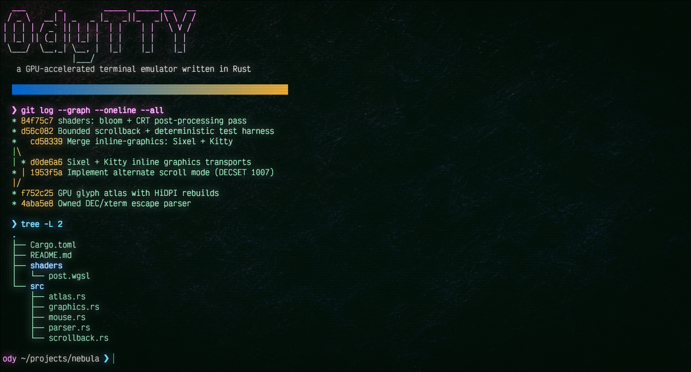

# OdyTTY

Published release: **v0.16.1**.

**A from-scratch, GPU-rendered Rust terminal with an Odyssey visual identity.**

[Website](https://odytty.unfinished-works.com) |
[Latest release](https://github.com/ghreprimand/odytty/releases/latest) |
[Release notes](docs/releases/README.md) |
[Install guide](docs/install.md) |
[Feature reference](docs/features.md) |
[Documentation](docs/README.md) |
[Issues](https://github.com/ghreprimand/odytty/issues)



OdyTTY owns the terminal path from the PTY through escape parsing, terminal
state, text layout, and shaders, and adds readable GPU text, tabs and panes,
inline media, in-app configuration, accessibility controls, and optional visual
effects on top. It is Linux-first, ships packaged macOS Apple Silicon and
Windows releases, and runs independently of OdysseyOS.

## Install

Choose the recommended release for your platform. The
[full install guide](docs/install.md) covers alternate packages, checksums,
source builds, signing prompts, desktop integration, default-terminal setup,
and troubleshooting.

### Linux

Install or update with one command - the same command does both, and it works in
any shell (bash, zsh, or fish):

```sh
curl -fsSL https://raw.githubusercontent.com/ghreprimand/odytty/master/dist/install.sh | bash
```

The script installs the matching apt or dnf package, or the portable binary
tarball on other x86_64 systems, after authenticating `SHA256SUMS` with the
pinned release key (it installs `minisign` first if needed). That check does
not cover the installer script itself, which the one-line form fetches from
mutable `master`; the [manual verified path](docs/install.md#linux) verifies the
versioned installer before execution.

Arch users can install `odytty` from the AUR with `paru -S odytty` or
`yay -S odytty`. Direct `.deb`, `.rpm`, AppImage, binary-tarball, and source
paths are documented in the [Linux install guide](docs/install.md#linux).
OdyTTY prefers Vulkan, also supports accelerated OpenGL/GLES, and treats
software rendering as a slow last resort. Wayland is the primary display
target; X11 is supported through the current windowing and GPU stack.

### macOS

The Homebrew cask installs the prebuilt Apple Silicon app with Homebrew 7.0
or newer (Homebrew normally auto-updates):

```sh
brew tap ghreprimand/odytty
brew install --cask odytty
```

The app is ad-hoc signed rather than notarized; the cask handles its disclosed
quarantine-clearing step. Intel Macs currently use the
[source build](docs/install.md#build-from-source).

### Windows

With [Scoop](https://scoop.sh) installed:

```powershell
scoop bucket add odytty https://github.com/ghreprimand/odytty
scoop install odytty
```

The release is unsigned, so Windows may show a SmartScreen prompt. Scoop
verifies the checksum, adds `odytty` to `PATH`, and creates a Start-menu entry.
See the [Windows install guide](docs/install.md#windows) for the portable zip,
first-launch steps, and current platform scope.

## Update

Use the same channel that installed OdyTTY:

| Installed with | Update |
| --- | --- |
| Linux installer | Re-run the one-line install command above. |
| Direct `.deb` or `.rpm` | Re-run the one-line install command, or download and install the latest package. OdyTTY does not publish an apt or dnf repository. |
| AUR | Run `paru -Syu` or `yay -Syu`; for a manual checkout, run `git pull --ff-only` and `makepkg -si`. |
| AppImage or tarball | Replace it with the always-latest artifact and verify the signed `SHA256SUMS`. From v0.16.1, AppImage update tools such as AppImageUpdate can use embedded AppImage update information; earlier AppImages require a manual replacement. |
| Homebrew | Run `brew update`, then `brew upgrade --cask odytty`. |
| Scoop | Run `scoop update`, then `scoop update odytty` (two commands; older Windows PowerShell rejects `&&`). |
| Source | Update the source tree, rebuild with `cargo build --release --locked`, and reinstall to the same prefix. |

The [update guide](docs/install.md#updating) provides exact commands for every
release format.

## Run And Configure

Open the default shell or launch a command directly:

```sh
odytty
odytty -e btop
```

Most customization is available inside the app:

| Action | Shortcut |
| --- | --- |
| Settings | `Ctrl+Shift+,` |
| Command palette | `Ctrl+Shift+P` |
| Theme picker | `Ctrl+Shift+H` |

Hand-editing is optional. When used, `odytty.conf` lives under
`$XDG_CONFIG_HOME/odytty/` or `~/.config/odytty/` on Unix and
`%APPDATA%\odytty\` on Windows. See the [settings guide](docs/settings-guide.md),
[keybindings](docs/keybindings.md), and
[launch CLI reference](docs/runtime-knobs.md#launch-cli) for the complete
surface, including command hold, application identity, layouts, and detached
sessions.

## Highlights

- **Owned terminal foundation:** PTY integration (Unix backend and Windows
  ConPTY), DEC/xterm parser, bounded terminal model, input mapping, render
  geometry, and shaders are OdyTTY's own.
- **GPU text and inline media:** bundled and system fonts, fallback chains,
  HiDPI rebuilds, color emoji where a color font is available, Kitty graphics,
  and Sixel share the `wgpu` renderer.
- **International text:** Unicode 17 terminal widths for Indic, Southeast
  Asian, and emoji sequences, font shaping for the enabled script groups, and
  opt-in bidirectional display; see the [feature reference](docs/features.md)
  and [shaping roadmap](docs/shaping-roadmap.md#current-support-boundary).
- **Daily terminal interaction:** Kitty keyboard, mouse modes, IME, search,
  selection and copy mode, hyperlinks, clickable paths, [paste
  safety](docs/features.md#paste-safety), and [shell
  integration](docs/features.md#shell-integration) prompt and command-output
  actions, with [notifications](docs/notifications.md) and pane monitors.
- **Workspaces and remote work:** tabs, panes, named workspaces, layouts,
  restore, [named launch profiles](docs/profiles.md), Unix detached sessions,
  an SSH connection manager, optional `tmux` persistence, and a searchable
  Session Navigator, and tab tear-out into a new window. Live tab drag in
  Settings follows the pointer on X11, Hyprland, macOS and Windows and restores the tab
  on cancellation; returning to the strip resumes the held reorder gesture.
- **Configuration without ceremony:** a live settings panel, command palette,
  145 built-in themes, user themes and a theme builder, backgrounds,
  transparency, and bloom, CRT, and retro effects, with config-file hot reload.
- **Accessibility and privacy:** contrast, color-vision, dimming, and motion
  controls. No telemetry, analytics, crash reporting, account, cloud sync, or
  update ping; network actions are explicit and user-initiated.

## Status

OdyTTY is a broad pre-1.0 terminal. The published v0.16.x line adds read-only
panes, broadcast input, moving tabs and panes between windows, stacked and
floating layouts, scrollback export, and AppImage update information; see the
[release notes](docs/releases/README.md). In development for the next release:
see [TODO.md](TODO.md) and the [full roadmap](docs/full-build-roadmap.md).

- **Linux:** the primary target; Wayland first, X11 supported.
- **macOS:** Apple Silicon releases; Intel Macs use the source build.
- **Windows:** x86_64 releases through Scoop or the portable zip.

Known gaps include the following:

- Windows detached and resumable session hosting.
- Complex-script shaping for script groups not yet enabled.
- Right-to-left paragraph levels and alternate-screen bidirectional
  reordering (reordering is an opt-in, off-by-default setting for the primary
  screen).

Performance evidence is in the [published benchmarks](docs/benchmark-results.md).
The terminal core and visual layer are deliberately separate; see the
[ownership boundary](SPEC.md#ownership-boundary),
[module map](CONTRIBUTING.md#module-map), and
[visual pipeline](docs/visual-architecture.md).

## Build And Test

OdyTTY pins Rust 1.96 as its verified minimum supported version. The repository
toolchain file selects it automatically when Rust is managed by `rustup`.

```sh
cargo build --release --locked
cargo test
cargo fmt --check
```

The default test suite is bounded and deterministic. Blocking CI adds Clippy,
platform builds, a locked fuzz-target API check, and a production-file architecture
guard; scheduled lanes run deeper fuzzing, Miri, and sanitizers. See the
[contribution guide](CONTRIBUTING.md#test-battery) for the complete test battery,
platform gates, and pre-commit checks.

Public maturity evidence: the
[compatibility corpus](docs/compatibility/corpus.md) turns conformance,
real-application, differential, parser, and fuzz findings into permanent
regressions; the [pinned vttest runner](docs/compatibility/vttest.md),
[fuzzing](fuzz/parser_graphics/README.md), and
[mutation testing](docs/mutation-testing.md) cover conformance and hostile
paths. None of this replaces wider third-party soak exposure.

## Documentation

- [Install and update guide](docs/install.md)
- [Feature reference](docs/features.md)
- [Paste safety and risky-paste triggers](docs/features.md#paste-safety)
- [Named-profile foundation and precedence](docs/v0.14.0-profiles-foundation.md)
- [External security review closure ledger](docs/security-review-2026-09.md)
- [External palette following](docs/v0.14.0-external-palette.md)
- [Settings guide](docs/settings-guide.md) and
  [runtime reference](docs/runtime-knobs.md)
- [Keybindings](docs/keybindings.md)
- [Accessibility](docs/accessibility.md)
- [Diagnostics](docs/diagnostics.md)
- [Benchmarks: protocol, apparatus, and results](docs/benchmark-results.md)
- [Architecture specification](SPEC.md)
- [Complete documentation index](docs/README.md)

## Contributing, Security, And License

Contributions are welcome. See [CONTRIBUTING.md](CONTRIBUTING.md) for what
lands easily, the test requirements, the Developer Certificate of Origin, and
the public-repository safety rules. Use the structured
[bug-report](https://github.com/ghreprimand/odytty/issues/new?template=bug_report.yml),
[change-proposal](https://github.com/ghreprimand/odytty/issues/new?template=change_proposal.yml),
or [question](https://github.com/ghreprimand/odytty/issues/new?template=question.yml)
form rather than guessing which route fits. Report vulnerabilities through the
private process in [SECURITY.md](SECURITY.md#reporting-a-vulnerability).

OdyTTY is licensed under **GPL-3.0-only**. You may use, study, share, and modify
the source under that license; distributed modifications must use the same
license. See [LICENSE](LICENSE).

Copyright (C) 2026 Unfinished Works and the OdyTTY contributors.

The OdyTTY name and branding are separate from the source license. Forks and
modified builds should use their own name and must not imply endorsement by
Unfinished Works. See [NOTICE](NOTICE).
